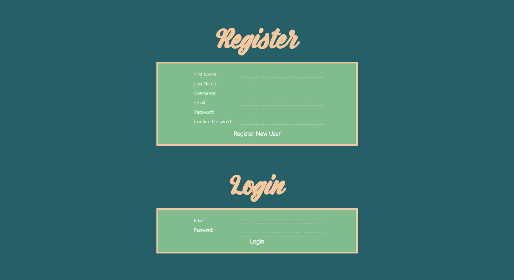
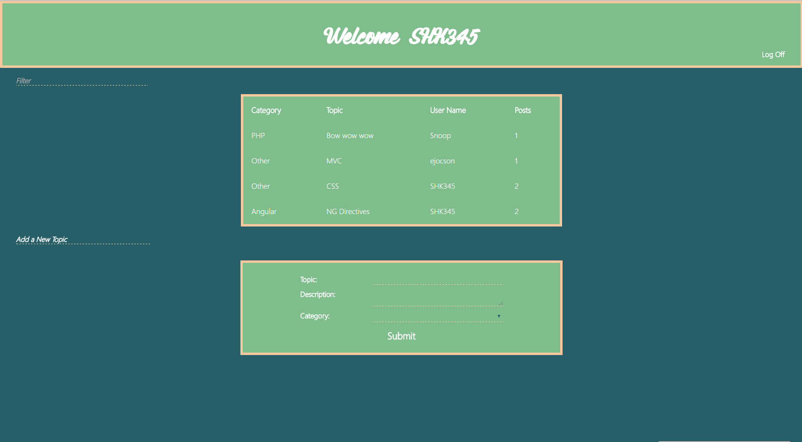

# Discusion Board
### A discussion board you would find similar in a Q&A site. A user can post questions regarding a topic and have other users respond or comment.

## Features
* Login and Registration
* Creation of topics
* Response to topics
* Filter of topics
 Integration of a database(MongoDB)
* Display of all posts retrieved from integrated database
* Display of individual users with total number of topics and comments posted
* Display of individual topics with responses from all users
* Up vote/ Down vote button so users may "like" or "dislike" their favorite responses

##Technologies Utilized
* MongoDB
* Express.js
* Angular.js
* Node.js
* AWS

